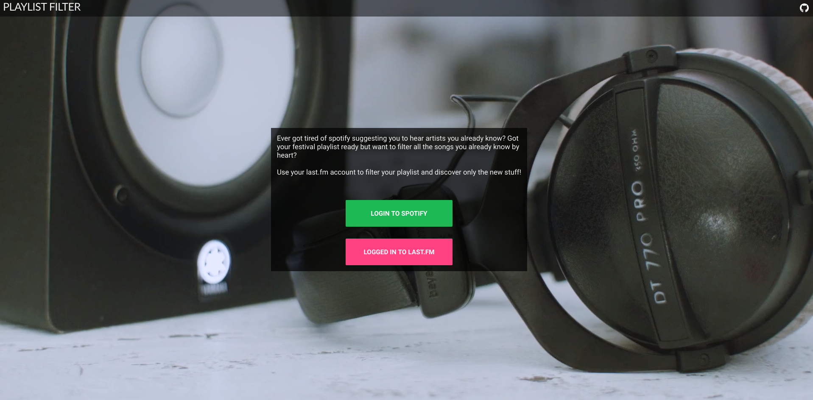
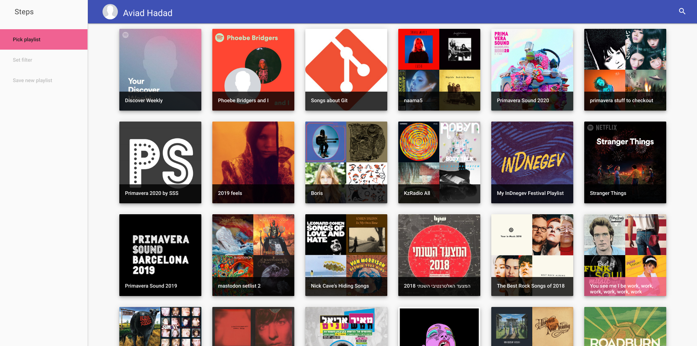
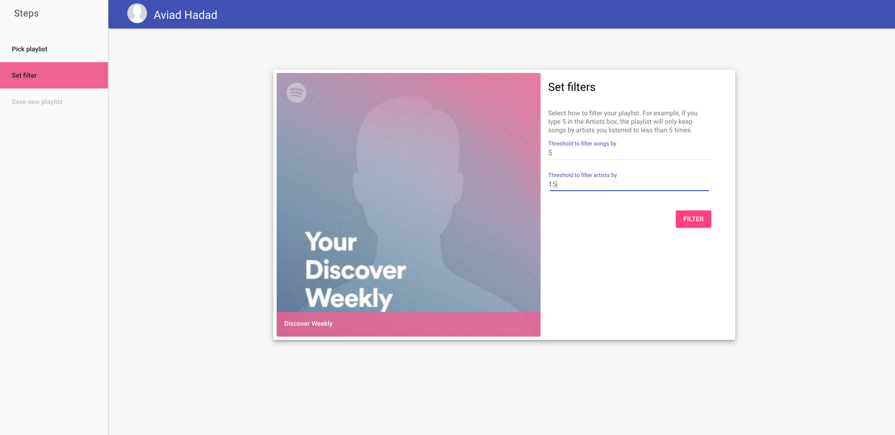
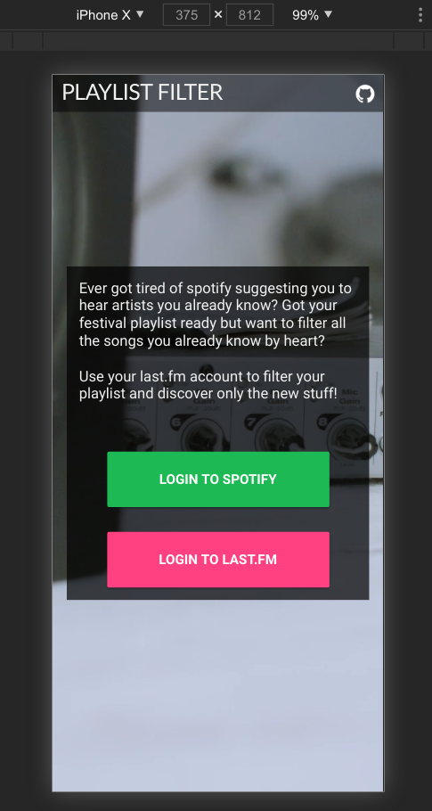
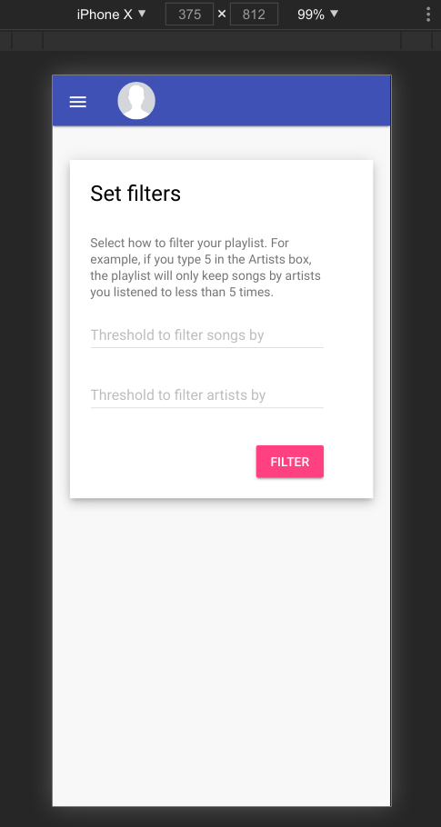
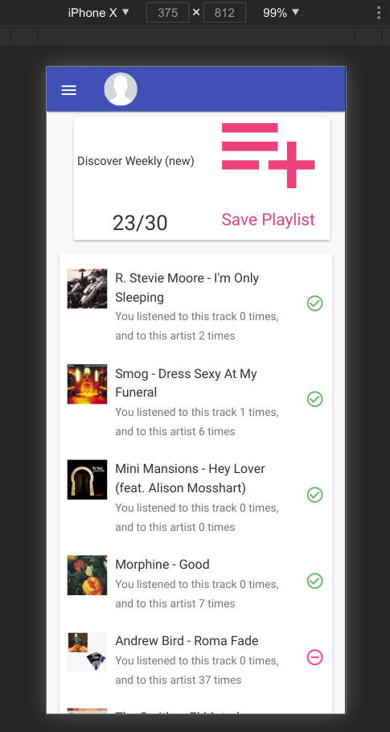

# Filter Spotify playlists by last.fm 

## What is this?

Handles the very niche case where I'm annoyed that sometimes spotify playlists and especially discover weekly includes songs and artists I'm already very familiar with. 

## Does it actually work? 
kinda, problem is a lot of times last.fm and spotify don't agree on name and artist names. 

## Sounds very weird, who the hell would want to use it?
Not clear, but I also wrote it to practice some skills. Mostly I wanted to try vanilla js and see how much feasible it is with modern browsers. Eventually I did opt to use typescript + scss, but beyond that - no module bundlers, no special build setup, no jquery, no any js frameworks.
It's a simple enough project that intend to re-write the codebase multiple with different technologies to compare between them, but still has enough to do to make the comparison meaningful. 

Currently done:
- (master): vanilla js + express.js. SSR using ejs templates. 

What I hope to do:
- react.js
- vue.js
- nest.js
- some jvm framework for server, spring or play

### credits
cover video from https://coverr.co/videos/putting-on-headphones-&-turning-on-volume-B6uZXEOo4Y

### screenshots

![save](./screenshots/4.png

test
